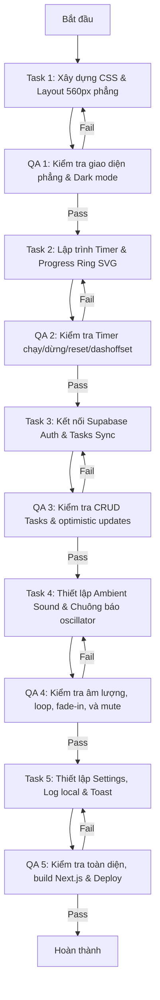

# Focus Timer Orchestrator Skill

Kỹ năng này điều hành đội ngũ tác nhân AI chuyên biệt để xây dựng và tích hợp hoàn chỉnh Focus Timer Web App.

## Chế độ chạy (Run Mode)
**Đội ngũ tác nhân (Agent Team)**:
- `FocusTimerDeveloper` chịu trách nhiệm về giao diện React, CSS phẳng và Web Audio API.
- `SupabaseIntegrator` chịu trách nhiệm về auth và đồng bộ CRUD dữ liệu qua Supabase.
- `QAAgent` chịu trách nhiệm chạy test, kiểm tra ranh giới dữ liệu và xác minh âm thanh.

## Luồng công việc (Workflow)

## Giao thức truyền dữ liệu
- Các agent trao đổi thông tin trực tiếp bằng `send_message`.
- Ghi nhận trạng thái hoàn thành của từng bước vào file `_workspace/status.json` để chia sẻ tiến độ chung.

## Kịch bản kiểm thử (Test Cases)

### Luồng thành công (Happy Path)
1. Truy cập `/working` chưa đăng nhập → hiện màn hình Google Login.
2. Đăng nhập thành công → tải danh sách task từ Supabase, hiển thị UI 1 cột phẳng 560px.
3. Thêm task mới thành công → click chọn task → hiển thị "Đang làm: [Tên Task]" dưới Timer.
4. Bật âm thanh nền "Mưa" → Bấm Bắt đầu → Tiếng mưa phát rào rào tăng dần âm lượng, timer chạy đếm ngược, SVG progress ring chuyển động thu ngắn.
5. Hết 25 phút → Timer về 0 → Toast trượt xuống đầu trang báo hoàn thành → Trình duyệt đẩy push notification → Tiếng chuông Zen Bell phát ngân 3 lần → Tự động cập nhật Stats số phiên hôm nay và số cà chua của task tăng lên 1 trên DB.
6. Nhật ký phiên ghi nhận 1 dòng log mới ở đầu danh sách.

### Luồng xử lý lỗi (Error Path)
1. Thêm task khi mất kết nối mạng → Báo lỗi đồng bộ trên đèn trạng thái header, vẫn hiển thị task tạm ở UI. Khi có mạng, tự động đồng bộ lại.
2. Trình duyệt chặn âm thanh do autoplay → Lazy-init khởi tạo khi user click nút bắt đầu đầu tiên để giải quyết triệt để lỗi.
