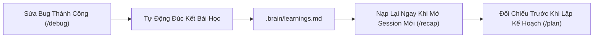

# ⚡ Anti-Workflow Ultimate (v4.8.0)

> **Khung Phát Triển Ứng Dụng Tự Trị Toàn Diện trên Antigravity 2.0.**  
> Tích hợp 5 trong 1: **AWF Orchestrator** + **Superpowers Subagent TDD Engine** + **GitNexus Relational Intelligence** + **Strict Physical Guardrails** + **Cổng Kiểm Thử Thông Minh (Smart Testing Pyramid & Process Guard)** + **Cơ Chế Tự Học Hỏi & Đúc Kết Bài Học Vĩnh Cửu (.brain/learnings.md)**.

---

## 🌟 5 Trụ Cột Kiến Trúc (The 5-Pillar Architecture)

```
┌─────────────────────────────────────────────────────────────────────────────┐
│ 1. ORCHESTRATION & TRẢI NGHIỆM (AWF)                                        │
│ • Giao tiếp tiếng Việt, Multi-persona (PM Hà, Dev Tuấn, Designer Mai, QA)   │
│ • Vòng đời khép kín: /init, /visualize (UI Mockup), /deploy, /save-brain    │
│ • Bộ nhớ vĩnh cửu: .brain/ (Lưu tiến độ & Tự học hỏi sau mỗi Bug Fix)       │
└──────────────────────────────────────┬──────────────────────────────────────┘
                                       │
┌──────────────────────────────────────▼──────────────────────────────────────┐
│ 2. GOVERNANCE & GUARDRAILS (Strict Enforcement)                             │
│ • Luật kỹ thuật: AI_CODE_WORKFLOW.md & GEMINI.md                            │
│ • Cổng gác vật lý: guardrails/ (Pre-commit hook, chặn commit main, test thật)│
│ • Cổng Smart Test & Process Guard: Chống nghẽn CPU 99%, tiết kiệm 80% Quota │
│ • Luật chống vá mò: Failed-first-fix rule, Explicit FK Hint Policy          │
└──────────────────────────────────────┬──────────────────────────────────────┘
                                       │
┌──────────────────────────────────────▼──────────────────────────────────────┐
│ 3. EXECUTION ENGINE (Superpowers Subagents)                                 │
│ • Subagent-Driven Development (chạy nền đa tác vụ tự trị theo task 2-5 phút)│
│ • Smart TDD: RED ➔ GREEN ➔ REFACTOR (Smallest Scoped Test < 1s)             │
│ • Git Worktree Isolation (cô lập môi trường làm việc trên từng feature)     │
│ • 2-Stage Code Review (Spec Compliance + Code Quality)                      │
└──────────────────────────────────────┬──────────────────────────────────────┘
                                       │
┌──────────────────────────────────────▼──────────────────────────────────────┐
│ 4. RELATIONAL INTELLIGENCE & MCP (GitNexus)                                 │
│ • Đồ thị tri thức Codebase (Knowledge Graph: LadybugDB + Tree-sitter AST)    │
│ • Blast Radius / Impact Analysis (tính toán chính xác vùng ảnh hưởng)       │
│ • 17 MCP Tools hỗ trợ AI tra cứu 360 độ (query, context, impact, trace)     │
└─────────────────────────────────────────────────────────────────────────────┘
```

---

## 🧠 Cơ Chế Tự Học Hỏi & Tiến Hóa Vĩnh Cửu (Self-Learning Engine)

> **Bí quyết để AI không bao giờ dẫm lại vết xe đổ:**



* **Auto-Reflection sau mỗi Bug Fix:** Sau khi vượt qua Cổng E2E Test, AI tự động lưu lại: *Triệu chứng*, *Root Cause*, *Giải pháp chuẩn (Proven Fix)*, và *Anti-Pattern cần tránh* vào `.brain/learnings.md`.
* **Tiêm vắc-xin cho Session mới:** Khi mở session mới (`/recap`) hoặc chuẩn bị `/plan`, AI tự động đọc các bài học cũ để không bao giờ viết code sai theo kiểu cũ.
* **Tiến hóa Guardrail:** Tự động nâng cấp checklist `/audit` hoặc thêm rules gác cổng nếu phát hiện lỗi nguy hiểm.

---

## 📦 Cài Đặt Ban Đầu (1 Lần Duy Nhất)

### Trên Windows (PowerShell):
```powershell
& "D:\AntiGravity\Anti-Workflow-Ultimate\install.ps1"
```

### Trên Linux / macOS:
```bash
bash "D:\AntiGravity\Anti-Workflow-Ultimate/install.sh"
```

---

> [!IMPORTANT]
> ## 🎯 DÀNH CHO DỰ ÁN ĐANG PHÁT TRIỂN (DỰ ÁN ĐÃ CÓ CODE):
> **Khi bạn mở Antigravity 2.0 ở thư mục dự án đang làm, bạn chỉ cần gõ:**
> ```text
> /init
> ```
> **👉 Workflow sẽ được TỰ ĐỘNG CÀI ĐẶT vào dự án và MỌI THỨ SẼ ĐƯỢC TỰ ĐỘNG KÍCH HOẠT!**
> 
> * **Không mất code:** Giữ nguyên 100% source code, branches và git history hiện có.
> * **Tự động cấu hình:** Tự động cài đặt Pre-commit Guardrail, nhận diện các lệnh test thật của dự án.
> * **Tự động quét kiến trúc:** Tự động chạy `gitnexus analyze` để AI hiểu toàn bộ mối quan hệ trong codebase cũ trong vài giây.
> * **Khám sức khỏe ngay:** Gợi ý chạy ngay `/audit` để phát hiện các lỗi ngầm, xung đột Database Foreign Key trước khi code tiếp!

---

## 🛡️ Cổng Kiểm Thử Thông Minh (Smart Testing Pyramid & Process Guard)

> **Triết lý cốt lõi:** *"Mục tiêu không phải là chạy ít test hơn. Mục tiêu là chạy ĐÚNG test, ở ĐÚNG tầng, vào ĐÚNG thời điểm."*

```
        / \
       /   \      3. FULL SUITE (Release Gate trước khi Deploy)
      /  ▲  \
     /───┼───\    2. TARGETED E2E SMOKE (Xác thực 1 Feature vừa xong - Timeout 30s)
    /    │    \
   /─────┴─────\  1. UNIT & COMPONENT TESTS (Chạy siêu tốc < 1s cho từng task nhỏ)
```

* **Chỉ test những gì ứng dụng sở hữu:** AI không test lại các cơ chế mà framework/database đã đảm bảo (như UUID collision hay DB ACID).
* **Không làm nóng máy & Treo CPU:** Loại bỏ hoàn toàn các bài test 100k CCU giả định hay stress test phi lý đối với app MVP/PoC.
* **Process Guard (Auto-Cleanup):** Tự động kill toàn bộ tiến trình ngầm (server, browser) ngay sau khi test, bảo vệ 100% RAM và CPU.
* **Targeted E2E:** Kiểm tra chính xác màn hình vừa làm, bắt dính lỗi API $\ge 400$ và lỗi Ambiguous FK mà không tốn thời gian chạy hồi quy toàn app.

---

## 🚀 Giao Thức Hội Thoại Độc Lập theo Module (Modular Conversation)

> **Bí quyết để AI không bao giờ bị loạn thông tin, không bị suy thoái ngữ cảnh (Context Rot) và tiết kiệm 90% chi phí Token:**

Thay vì giữ một cuộc trò chuyện dài hàng trăm tin nhắn, toàn bộ quá trình phát triển được cắt lát thành các Session độc lập:

1. **Session 1 (Thiết kế & Lập Plan):**
   * `/init` $\to$ `/brainstorm` $\to$ `/visualize` $\to$ `/plan` (đối chiếu bài học cũ).
   * Chạy `/save-brain` $\to$ Đóng gói Spec & Plan vào `docs/superpowers/`.
2. **Session 2 (Code Backend & DB):**
   * **Mở Thread Chat MỚI** $\to$ Gõ `/recap` (AI chỉ nạp ~800 token ngữ cảnh tinh gọn + bài học cũ).
   * Chạy `/code phase-01` $\to$ Subagent code Smart TDD + Targeted E2E $\to$ Chạy `/save-brain`.
3. **Session 3 (Code Frontend UI):**
   * **Mở Thread Chat MỚI** $\to$ Gõ `/recap` $\to$ Chạy `/code phase-02` (Smart TDD + Targeted E2E).
4. **Session 4 (Kiểm toán & Deploy):**
   * **Mở Thread Chat MỚI** $\to$ Gõ `/audit` $\to$ User Live-Test $\to$ Gõ `/deploy`.

---

## 🎮 Bảng Lệnh Slash Commands (/commands) & Ngôn Ngữ Tự Nhiên

Anh có thể **gõ trực tiếp Slash Command** hoặc **nói bằng ngôn ngữ tự nhiên**, AI sẽ tự động hiểu và kích hoạt đúng quy trình tương ứng:

| Lệnh Slash | Chức năng | 🗣️ Hoặc nói tự nhiên | Hành động thực tế của AI |
| :--- | :--- | :--- | :--- |
| `/init` | 🏁 Khởi tạo / Tích hợp dự án | *"Tạo dự án mới...", "Tích hợp workflow vào dự án này..."* | **Tự động nhận diện dự án mới hoặc dự án đang làm**, cài Guardrail, quét GitNexus. |
| `/brainstorm` | 💡 Phỏng vấn ý tưởng | *"Bàn ý tưởng...", "Lên ý tưởng tính năng..."* | Phỏng vấn Socratic câu hỏi đơn, xuất bản Spec chi tiết vào `docs/superpowers/specs/`. |
| `/visualize` | 🎨 Mockup UI/UX | *"Thiết kế giao diện...", "Dựng mockup UI..."* | Tạo prototype HTML/CSS trực quan, trích xuất bảng Design Tokens. |
| `/plan` | 📋 Kế hoạch TDD | *"Lên kế hoạch làm...", "Phân rã task cho tính năng..."* | Đối chiếu `.brain/learnings.md` $\to$ Tính Blast Radius $\to$ Chia nhỏ task 2–5 phút. |
| `/code` | 💻 Lập trình Subagent | *"Bắt đầu code...", "Lập trình phase 1 đi em"* | Tạo Git Worktree $\to$ Subagents chạy Smart TDD $\to$ **Cổng Targeted E2E**. |
| `/debug` | 🐛 Sửa lỗi & Tự học hỏi | *"Sửa lỗi này...", "Fix bug này giúp anh"* | 4 Phase Root-Cause $\to$ Targeted E2E $\to$ **Tự động đúc kết bài học vào .brain/learnings.md**. |
| `/test` | 🧪 Kiểm thử toàn diện | *"Chạy kiểm thử...", "Test app xem chạy ổn không"* | Chạy theo phân tầng: Quick Scoped / Feature E2E / Full Suite Release Gate. |
| `/review` | 👀 Review 2 lớp | *"Review lại code...", "Kiểm tra chất lượng code"* | Reviewer độc lập duyệt Spec Compliance + Code Quality + GitNexus shape check. |
| `/audit` | 🔒 Kiểm toán toàn diện | *"Khám bệnh app...", "Kiểm tra bảo mật và DB"* | Quét Bảo mật, Code Quality, Dependencies và **Database Relationship Integrity**. |
| `/deploy` | 🚀 Triển khai Production | *"Đưa app lên mạng...", "Deploy lên Vercel/VPS"* | Vượt qua Cổng Live-Test $\to$ Deploy lên Vercel, Cloudflare, VPS, Docker. |
| `/recap` | 📖 Khôi phục ngữ cảnh | *"Tiếp tục dự án hôm trước...", "Nhớ lại bối cảnh"* | Nạp Clean Context (< 1.000 tokens) kèm các bài học kinh nghiệm đã tích lũy. |
| `/save-brain` | 🧠 Lưu bộ nhớ vĩnh cửu | *"Lưu lại tiến độ...", "Đóng gói bộ nhớ hôm nay"* | Lưu trữ quyết định kỹ thuật, checkpoint tiến độ và chuẩn bị Handover. |

---

## 🛡️ Cổng Kiểm Soát Vật Lý (Strict Guardrails)

Hệ thống pre-commit hook tại `guardrails/` đảm bảo:
* ❌ **Cấm tuyệt đối commit lên `main` và `master`** (phải làm việc trên feature branch).
* ❌ **Cấm commit nếu các lệnh thật bị lỗi:** `tests`, `lint`, `typecheck`, `build`, `e2e`.
* ❌ **Cấm để sót debug marker:** Tự động phát hiện `DEBUG_ONLY`, `console.log` thừa.
* ❌ **Cấm lách cổng:** Chặn mọi hành vi dùng `git commit --no-verify`.

---

## 📂 Cấu Trúc Dự Án Tiêu Chuẩn

```
{project}/
├── .brain/                     # Eternal Memory & Continuous Learnings
│   ├── learnings.md            # 🧠 BÀI HỌC KINH NGHIỆM ĐÃ TÍCH LŨY
│   ├── preferences.json        # Technical level & Persona
│   ├── session.json            # State hiện tại
│   └── session_log.txt         # Append-only log
├── .gemini/                    # Antigravity 2.0 MCP & Hooks
├── docs/
│   └── superpowers/
│       ├── specs/              # Feature Specs
│       └── plans/              # Implementation Plans (TDD)
├── guardrails/                 # Engine cổng kiểm soát
├── AGENTS.md                   # Multi-agent directives
├── AI_CODE_WORKFLOW.md         # Quy tắc kỹ thuật bất biến
└── README.md
```

---

**Chúc anh kiến tạo những ứng dụng đỉnh cao cùng Antigravity 2.0!** 🚀
