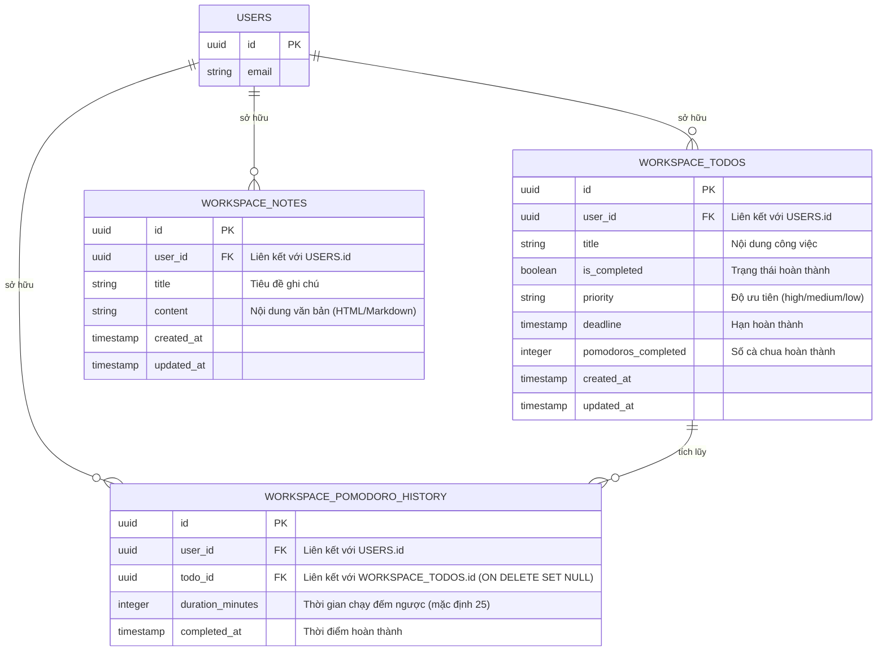

# 🎨 DESIGN: Personal Working Space (Next.js & Supabase)

**Ngày tạo:** 2026-06-19
**Thiết kế bởi:** Minh (Solution Architect)
**Dựa trên:** [BRIEF.md](file:///c:/Users/Trong/Desktop/tulanh-simple-Tulanh/docs/BRIEF.md)

---

## 1. Cách Lưu Thông Tin (Database Schema)

Dữ liệu của không gian làm việc được quản lý bằng 3 bảng chính, liên kết trực tiếp với bảng người dùng hệ thống (`auth.users` của Supabase) để đảm bảo tính riêng tư và bảo mật (Row Level Security - RLS).



---

## 2. Giao Diện Làm Việc (Layout Dashboard 3 Cột)

Trang `/working` được xây dựng bằng thiết kế responsive, trên desktop chia làm 3 cột chính từ trái qua phải:

```
┌────────────────────────────────────────────────────────────────────────────────────────┐
│  [Logo] Tulanh-simple                     [Workspace]                        [Thoát]  │
├────────────────────────────────────────────────────────────────────────────────────────┤
│  CỘT 1: TODO LIST (35%)   │  CỘT 2: NOTE SPACE (40%)       │ CỘT 3: POMODORO TIMER (25%)│
│  ┌──────────────────────┐ │  ┌──────────┬────────────────┐ │ ┌──────────────────────┐ │
│  │ ➕ Thêm công việc     │ │  │ Ghi chú  │ Tiêu đề Note   │ │ │     Focusing 🎯      │ │
│  │ [Tên việc...]        │ │  │ ┌──────┐ │ ┌────────────┐ │ │ │                      │ │
│  │ [! Cao] [📅 Hạn] [Lưu]│ │  │ │Note A│ │ │ B | I | •    │ │ │        25:00         │ │
│  ├──────────────────────┤ │  │ ├──────┤ │ ├────────────┤ │ │ │                      │ │
│  │ ▢ Việc 1  [!C] [Focus]│ │  │ │Note B│ │ │ content... │ │ │   [Play] [Reset]     │ │
│  │ ▢ Việc 2  [!T] [Focus]│ │  │ └──────┘ │ │            │ │ │                      │ │
│  │ ☑ Việc 3  [!Th]      │ │  │ [➕New]  │ │ (Auto-save)│ │ │ Target: [Việc 1]     │ │
│  └──────────────────────┘ │  └──────────┴────────────────┘ │ │ 🍅🍅 (Hôm nay)       │ │
│                           │                                │ └──────────────────────┘ │
└────────────────────────────────────────────────────────────────────────────────────────┘
```

---

## 3. Luồng Hoạt Động Chi Tiết (User Journey)

### 3.1. Luồng chạy Pomodoro liên kết Todo
1. Người dùng vào `/working`, chọn một công việc (ví dụ: "Viết tài liệu thiết kế") và bấm nút **Focus 🎯**.
2. Widget Pomodoro hiển thị: *"Đang tập trung cho: Viết tài liệu thiết kế"*.
3. Người dùng bấm **Start/Play** trên đồng hồ Pomodoro.
4. Trình đếm ngược đếm giây giảm dần từ `25:00` xuống `00:00`.
5. Khi đồng hồ về `00:00`:
   - Trình duyệt phát ra âm thanh báo bằng Web Audio API (chuỗi tiếng bíp lặp lại).
   - Một Popup Modal xuất hiện giữa màn hình: *"Phiên làm việc đã kết thúc! Bạn đã hoàn thành xuất sắc. Hãy nghỉ ngơi 5 phút nhé."*
   - Hệ thống tự động gửi yêu cầu lên database:
     - Tăng số `pomodoros_completed` của task tương ứng lên 1.
     - Thêm một bản ghi vào bảng `workspace_pomodoro_history`.
   - Giao diện cập nhật: Task đó được cộng thêm 1 icon 🍅, và bộ thống kê cà chua chung của ngày hôm nay tăng lên 1.
   - Đồng hồ tự động chuyển sang trạng thái "Nghỉ ngơi ☕" và đặt mốc thời gian là `05:00`.

### 3.2. Luồng soạn thảo Ghi chú Auto-save
1. Người dùng bấm nút **➕ Thêm ghi chú mới** ở sidebar ghi chú. Một ghi chú mới được insert lên Supabase với tiêu đề `"Ghi chú mới"`.
2. Danh sách cập nhật và hiển thị ghi chú mới này ở trạng thái active.
3. Người dùng bắt đầu gõ tiêu đề hoặc gõ nội dung trong Editor (sử dụng in đậm `Ctrl+B`, in nghiêng `Ctrl+I`, list).
4. Mỗi khi người dùng gõ phím, UI hiển thị nhãn: **"Đang soạn thảo... ✍️"**.
5. Hệ thống khởi động một timer đếm ngược 2 giây (Debounce). Nếu người dùng tiếp tục gõ, timer được làm mới (chưa lưu).
6. Khi người dùng dừng gõ đủ 2 giây:
   - UI hiển thị nhãn: **"Đang lưu... ⏳"**.
   - Gửi request UPDATE nội dung và tiêu đề ghi chú lên bảng `workspace_notes` trong database.
   - Khi lưu thành công, UI hiển thị: **"Đã lưu lúc HH:MM:SS"** (màu xanh lá nhẹ, mờ dần sau vài giây).

---

## 4. Checklist Kiểm Tra & Test Cases

### TC-01: Auto-save Ghi chú
- **Given:** Người dùng đang ở màn hình Workspace, đã chọn một ghi chú đang soạn thảo.
- **When:** Người dùng gõ đoạn văn bản: `"Đây là ghi chú quan trọng"` và dừng gõ.
- **Then:**
  - ✓ Trong vòng 2 giây sau khi dừng gõ, chữ "Đang lưu..." phải xuất hiện.
  - ✓ Sau khi lưu xong, chữ "Đã lưu lúc [thời gian]" xuất hiện.
  - ✓ Nếu người dùng nhấn F5 tải lại trang, nội dung `"Đây là ghi chú quan trọng"` vẫn được giữ nguyên đầy đủ.

### TC-02: Đồng bộ Pomodoro hoàn thành với Todo
- **Given:** Người dùng đã chọn một task có tên `"Code API"` làm mục tiêu Focus. Số phiên Pomodoro hiện tại của task này là `0`.
- **When:** Đồng hồ Pomodoro chạy hết 25 phút (hoặc hết thời gian chạy thử 5 giây).
- **Then:**
  - ✓ Phát ra âm thanh chuông báo và hiển thị modal thông báo hoàn thành.
  - ✓ Cột Todo list cập nhật: task `"Code API"` hiển thị có `1 🍅`.
  - ✓ Số cà chua tích lũy hôm nay tăng lên 1.
  - ✓ Trong bảng `workspace_todos` của Supabase, trường `pomodoros_completed` của task đó tăng từ `0` lên `1`.

### TC-03: Chống mất mát dữ liệu khi mất kết nối (Resilience)
- **Given:** Người dùng đang soạn thảo ghi chú.
- **When:** Máy tính bị ngắt kết nối mạng (mất internet) và người dùng tiếp tục gõ chữ, sau đó dừng lại.
- **Then:**
  - ✓ Hệ thống nhận diện lỗi kết nối từ Supabase, hiển thị trạng thái *"Lỗi đồng bộ - Sẽ lưu lại khi có mạng"* (màu đỏ).
  - ✓ Không làm mất nội dung đang viết trên màn hình của người dùng.
  - ✓ Khi có internet trở lại, hệ thống tự động lưu phần nội dung chưa đồng bộ lên database.

---

*Thiết kế bởi Antigravity Solution Designer — Minh (Software Architect)*
