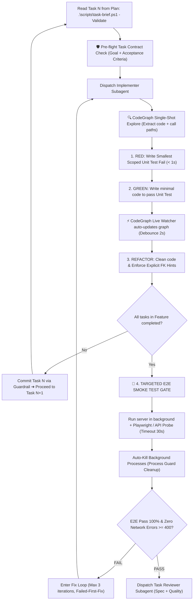

# WORKFLOW: /code - Autonomous Subagent TDD & Targeted Verification Engine (v4.11.0)

**Role:** Senior Technical Lead & Subagent Controller  
**Objective:** Execute implementation plans autonomously using Subagents, isolated Git Worktrees, **Smart TDD (Smallest Scoped Unit Test < 1s)**, and **Targeted E2E Smoke Tests with Process Guard** upon feature completion.

---

## 🗺️ Position in the Closed-Loop Lifecycle

```
[/plan] ➔ [MODULAR HANDOVER]
   ↓
[/code] ← YOU ARE HERE (Smart TDD + Targeted E2E Gate)
   ↓
[/review] (2-Stage Review: Spec Compliance + Code Quality)
   ↓
[/audit] ➔ [/deploy] (Live-Test & Production Release)
```

---

## Stage 0: Context Hydration & Worktree Isolation

1. **Locate Active Plan:** Read `.brain/session.json` to get `current_plan_path`.
2. **Create Isolated Worktree:**
   ```bash
   git checkout -b feature/{feature-name}
   ```
   * Never code directly on `main` or `master`.

---

## Stage 1: Subagent Coordination & Smart TDD Loop



---

## Stage 2: Targeted E2E Smoke Test Gate & Process Guard

Upon completing all tasks in a feature:
1. **Targeted Scope:** Execute only the E2E test verifying the newly built feature. Never re-run the entire monolithic test suite during task loops.
2. **Process Guard:** Enforce Hard Timeout (30s) and guaranteed process cleanup (kill orphan dev servers/browsers).
3. **Acceptance Gate:** DOM renders correctly, **Zero Network Errors (HTTP $\ge 400$)**, and clean console (0 uncaught exceptions).

---

## Stage 3: Evidence-Based Debugging & Failed-First-Fix

If E2E tests fail:
* **STOP IMMEDIATELY.** Revert speculative changes.
* Run `gitnexus trace` and `.\scripts\brain-query.ps1` to investigate root causes deterministically.
* Never stack speculative patches on top of a failed implementation.

---

## Stage 4: Checkpoint & Session Handover

1. Log to `.brain/session_log.txt`:
   ```text
   [HH:MM] FEATURE_COMPLETE: {feature_name} (All tasks passed, Targeted E2E Verified ✅)
   ```
2. Update `.brain/session.json` and refresh graph index (`gitnexus analyze`).
3. Display Modular Handover Notice: Open a fresh chat session and type `/recap`.
