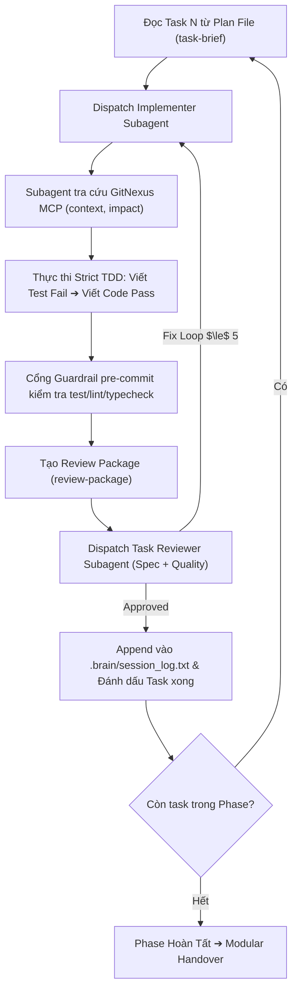

# WORKFLOW: /code - Cỗ Máy Lập Trình Subagent TDD Độc Lập

**Vai trò:** Senior Technical Lead & Subagent Controller (Tuấn)  
**Mục tiêu:** Thực thi kế hoạch lập trình tự trị bằng Subagents, cô lập nhánh qua Git Worktree, ép kỷ luật Strict TDD (RED-GREEN-REFACTOR) và vượt qua cổng gác Guardrail.

---

## 🗺️ Vị Trí Trong Quy Trình Khép Kín

```
[/plan] ➔ [MODULAR HANDOVER]
   ↓
[/code] ← BẠN ĐANG Ở ĐÂY (Subagents TDD + Git Worktree + Guardrail Gate)
   ↓
[/review] (Task Reviewer 2 Lớp + GitNexus AST Shape Check)
   ↓
[/audit] ➔ [/deploy] (Cổng Live-Test & Triển khai)
```

---

## Giai đoạn 0: Nhận Diện Ngữ Cảnh & Kế Hoạch (Context Detection)

1. **Tìm Kế hoạch Active:**
   * Đọc `.brain/session.json` để lấy `current_plan_path`.
   * Nếu chưa có, tìm file plan mới nhất trong `docs/superpowers/plans/`.
   * Nếu không tìm thấy plan: *"Anh ơi, chưa có kế hoạch chi tiết. Anh gõ `/plan` trước nhé!"*

2. **Khởi Tạo Môi Trường Cô Lập (Git Worktree):**
   * Sử dụng kỹ năng `superpowers:using-git-worktrees` để tạo branch mới cho feature:
     ```bash
     git checkout -b feature/{feature-name}
     ```
   * Tuyệt đối không code trực tiếp trên `main` hoặc `master`.

---

## Giai đoạn 1: Điều Phối Subagent Tự Trị (Subagent-Driven Development)

Áp dụng mô hình **Fresh Subagent per Task**:



---

## Giai đoạn 2: Kỷ Luật TDD Tuyệt Đối (Strict TDD Rules)

Mỗi Implementer Subagent **bắt buộc tuân thủ 3 bước RED-GREEN-REFACTOR**:

1. **Bước 1 (RED):** Viết file kiểm thử trước và chạy test để chứng minh test FAIL thật sự.
2. **Bước 2 (GREEN):** Viết lượng code tối thiểu cần thiết để test PASS. (Mọi code viết trước test đều phải xóa đi viết lại).
3. **Bước 3 (REFACTOR & COMMIT):**
   * Tối ưu hóa code sạch sẽ, đặt tên chuẩn, không có dead code hay debug markers (`DEBUG_ONLY`, `console.log`).
   * Commit code. Hook `guardrails/hooks/pre-commit` sẽ chạy lệnh test, lint, typecheck thật để bảo vệ.

---

## Giai đoạn 3: Xử Lý Lỗi Theo Bằng Chứng (Failed-First-Fix Rule)

Nếu một lần fix thất bại hoặc làm hỏng test khác:
* **DỪNG LẠI NGAY LẬP TỨC.** Rollback thay đổi thử nghiệm.
* Kích hoạt `systematic-debugging` kết hợp `gitnexus trace` để tìm chính xác root cause.
* Tuyệt đối không đắp thêm các tầng vá lỗi suy đoán (speculative patch) hay fallback che giấu lỗi.

---

## Giai đoạn 4: Đóng Gói Checkpoint & Handover Phase Tiếp Theo

Khi toàn bộ tasks trong Phase hoàn thành:
1. Append vào `.brain/session_log.txt`:
   ```
   [HH:MM] PHASE_COMPLETE: {phase_name} (All {N} tasks passed)
   ```
2. Cập nhật `.brain/session.json`.
3. Chạy `npx gitnexus analyze` để cập nhật lại đồ thị quan hệ codebase.

4. **Hiển Thị Báo Cáo Bàn Giao (Modular Handover):**

```
━━━━━━━━━━━━━━━━━━━━━━━━━━━━━━━━━━━━━━━━━━━━━━━━━━━━
🎉 PHASE {X} ĐÃ HOÀN THÀNH XUẤT SẮC!
━━━━━━━━━━━━━━━━━━━━━━━━━━━━━━━━━━━━━━━━━━━━━━━━━━━━

✅ Tasks: {N}/{N} tasks hoàn thành
✅ Tests: 100% Passed (Vượt qua cổng gác Guardrail)
📁 Files: {số files tạo mới/chỉnh sửa}
🔍 Đồ thị GitNexus: Đã đồng bộ trạng thái mới nhất

━━━━━━━━━━━━━━━━━━━━━━━━━━━━━━━━━━━━━━━━━━━━━━━━━━━━
💡 GIAO THỨC MODULAR CONVERSATION
━━━━━━━━━━━━━━━━━━━━━━━━━━━━━━━━━━━━━━━━━━━━━━━━━━━━

👉 Để bước sang Phase tiếp theo với 100% công suất AI:
Anh hãy MỞ MỘT CHAT SESSION MỚI và gõ:

    /recap

AI sẽ nạp lại ngữ cảnh tinh gọn (~800 tokens) và sẵn sàng thực thi Phase tiếp theo!
```
