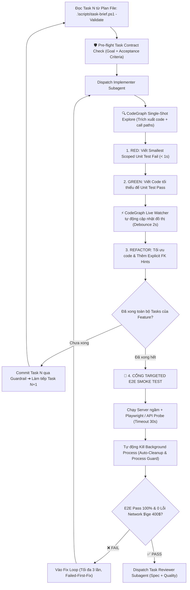

# WORKFLOW: /code - Cỗ Máy Lập Trình Subagent TDD & Cổng Kiểm Thử Thông Minh

**Vai trò:** Senior Technical Lead & Subagent Controller (Tuấn)  
**Mục tiêu:** Thực thi kế hoạch lập trình tự trị bằng Subagents, cô lập nhánh qua Git Worktree, áp dụng **Smart TDD (Smallest Scoped Test cho từng task $< 2$s)** và **Targeted E2E Smoke Test (có auto-cleanup tiến trình)** khi hoàn thành Feature.

---

## 🗺️ Vị Trí Trong Quy Trình Khép Kín

```
[/plan] ➔ [MODULAR HANDOVER]
   ↓
[/code] ← BẠN ĐANG Ở ĐÂY (Smart TDD + CỔNG TARGETED E2E)
   ↓
[/review] (Task Reviewer 2 Lớp + GitNexus AST Shape Check)
   ↓
[/audit] ➔ [/deploy] (Cổng Live-Test & Triển khai)
```

---

## Giai đoạn 0: Nhận Diện Ngữ Cảnh & Kế Hoạch (Context Detection)

1. **Tìm Kế hoạch Active:**
   * Đọc `.brain/session.json` để lấy `current_plan_path`.
   * Nếu chưa có, tìm file plan mới nhất trong `docs/superpowers/plans/`.
2. **Khởi Tạo Môi Trường Cô Lập (Git Worktree):**
   * Sử dụng kỹ năng `superpowers:using-git-worktrees` tạo branch mới:
     ```bash
     git checkout -b feature/{feature-name}
     ```
   * Tuyệt đối không code trực tiếp trên `main` hoặc `master`.

---

## Giai đoạn 1: Điều Phối Subagent & Vòng Lặp Smart TDD (Hybrid Code-Intelligence)

Áp dụng quy tắc **Kim Tự Tháp Kiểm Thử (Test Pyramid)** kết hợp **CodeGraph Live Auto-Sync** trong từng Task:



---

## Giai đoạn 2: Chi Tiết Cổng Targeted E2E & Bảo Vệ Tiến Trình (Process Guard)

Khi toàn bộ tasks của Feature đã hoàn thành, AI thực hiện bước nghiệm thu:

1. **Chỉ Test Đúng Tính Năng Vừa Làm (Targeted E2E):**
   * Không chạy lại toàn bộ test suite khổng lồ của cả hệ thống. Chỉ chạy kịch bản E2E kiểm tra đúng màn hình/API vừa phát triển.
   * **Quy tắc Smart Test:** Chỉ test logic nghiệp vụ của ứng dụng, không test lại framework/database primitives (như trùng UUID hay ACID isolation).
2. **Kiểm soát Timeout & Tự Động Dọn Dẹp Tiến Trình (Process Guard):**
   * Thiết lập **Hard Timeout (30s)** cho kịch bản E2E.
   * **Bắt buộc Cleanup:** Dù test PASS hay FAIL, script phải tự động kill dev server và headless chrome, không để lại tiến trình ma gây ngốn CPU/RAM.
3. **Tiêu Chí Đạt Cổng E2E (Acceptance Criteria):**
   * ✅ DOM render đúng dữ liệu từ Database.
   * ✅ **Zero Network Errors:** Không có bất kỳ request API nào trả về HTTP status $\ge 400$ (bắt dính lỗi Ambiguous FK hay CORS).
   * ✅ Browser Console sạch (0 Uncaught Exceptions).

---

## Giai đoạn 3: Xử Lý Lỗi Theo Bằng Chứng (Failed-First-Fix Rule)

Nếu một lần fix E2E thất bại:
* **DỪNG LẠI NGAY LẬP TỨC.** Rollback thay đổi thử nghiệm.
* Kích hoạt `systematic-debugging` kết hợp `gitnexus trace` để tìm chính xác root cause.
* Cấm đắp thêm các tầng vá lỗi suy đoán (speculative patch) hay fallback che giấu lỗi.

---

## Giai đoạn 4: Đóng Gói Checkpoint & Handover Phase Tiếp Theo

Khi toàn bộ Feature hoàn thành và **Targeted E2E đã PASS**:
1. Append vào `.brain/session_log.txt`:
   ```
   [HH:MM] FEATURE_COMPLETE: {feature_name} (All tasks passed, Targeted E2E Verified ✅)
   ```
2. Cập nhật `.brain/session.json`.
3. Chạy `npx gitnexus analyze` để cập nhật lại đồ thị quan hệ codebase.

4. **Hiển Thị Báo Cáo Bàn Giao (Modular Handover):**

```
━━━━━━━━━━━━━━━━━━━━━━━━━━━━━━━━━━━━━━━━━━━━━━━━━━━━
🎉 FEATURE {X} ĐÃ HOÀN THÀNH XUẤT SẮC!
━━━━━━━━━━━━━━━━━━━━━━━━━━━━━━━━━━━━━━━━━━━━━━━━━━━━

✅ Tasks: {N}/{N} tasks hoàn thành (Smart TDD Unit Tests $< 1$s)
🌐 Targeted E2E: PASSED (Đã xác thực hành vi thật trên trình duyệt & Database)
🧹 Tiến trình: Đã dọn dẹp sạch sẽ (CPU/RAM mát rượi)
📁 Files: {số files tạo mới/chỉnh sửa}

━━━━━━━━━━━━━━━━━━━━━━━━━━━━━━━━━━━━━━━━━━━━━━━━━━━━
💡 GIAO THỨC MODULAR CONVERSATION
━━━━━━━━━━━━━━━━━━━━━━━━━━━━━━━━━━━━━━━━━━━━━━━━━━━━

👉 Để bước sang Phase tiếp theo với 100% công suất AI:
Anh hãy MỞ MỘT CHAT SESSION MỚI và gõ:

    /recap

AI sẽ nạp lại ngữ cảnh tinh gọn (~800 tokens) và sẵn sàng thực thi Phase tiếp theo!
```
