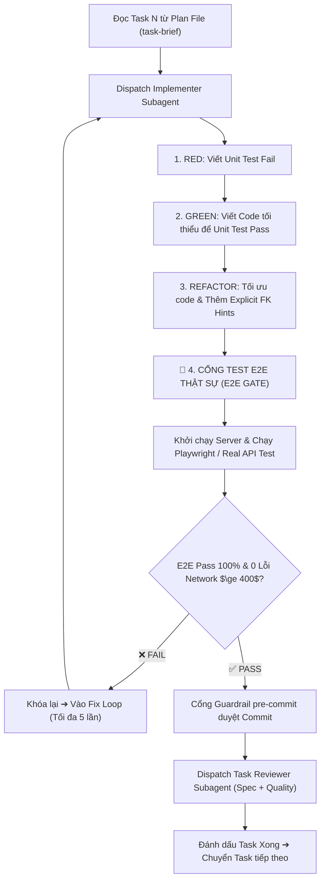

# WORKFLOW: /code - Cỗ Máy Lập Trình Subagent TDD & Cổng E2E Bắt Buộc

**Vai trò:** Senior Technical Lead & Subagent Controller (Tuấn)  
**Mục tiêu:** Thực thi kế hoạch lập trình tự trị bằng Subagents, cô lập nhánh qua Git Worktree, ép kỷ luật Strict TDD (RED-GREEN-REFACTOR) và **bắt buộc vượt qua Cổng Test E2E Thật Sự (E2E Pass-to-Proceed Gate)** trước khi chuyển sang task tiếp theo.

---

## 🗺️ Vị Trí Trong Quy Trình Khép Kín

```
[/plan] ➔ [MODULAR HANDOVER]
   ↓
[/code] ← BẠN ĐANG Ở ĐÂY (Subagents TDD + CỔNG TEST E2E THẬT SỰ)
   ↓
[/review] (Task Reviewer 2 Lớp + GitNexus AST Shape Check)
   ↓
[/audit] ➔ [/deploy] (Cổng Live-Test & Triển khai)
```

---

## Giai đoạn 0: Nhận Diện Ngữ Cảnh & Kế Hoạch (Context Detection)

1. **Tìm Kế hoạch Active:**
   * Đọc `.brain/session.json` để lấy `current_plan_path`.
   * Nếu chưa có, tìm file plan mới nhất trong `docs/superpowers/plans/`.
2. **Khởi Tạo Môi Trường Cô Lập (Git Worktree):**
   * Sử dụng kỹ năng `superpowers:using-git-worktrees` tạo branch mới:
     ```bash
     git checkout -b feature/{feature-name}
     ```
   * Tuyệt đối không code trực tiếp trên `main` hoặc `master`.

---

## Giai đoạn 1: Điều Phối Subagent & Vòng Lặp TDD + E2E Gate

Áp dụng quy trình **4 Bước Bắt Buộc Mỗi Task (RED ➔ GREEN ➔ REFACTOR ➔ E2E GATE)**:



---

## Giai đoạn 2: Chi Tiết Thực Thi Cổng E2E Bắt Buộc (E2E Verification)

Sau khi code đã pass Unit Test, AI **tự động thực hiện**:

1. **Khởi động server cục bộ:**
   * Kích hoạt dev server ở chế độ background: `npm run dev` (hoặc API server).
2. **Chạy kịch bản E2E Test tương ứng với Task vừa làm:**
   * Sử dụng **Playwright / Headless Browser** hoặc **API Integration Probe**:
     ```bash
     # Web UI E2E
     npx playwright test tests/e2e/{feature}.spec.ts
     # hoặc API E2E
     npm run test:e2e
     ```
3. **Tiêu Chí Đạt Cổng E2E (E2E Acceptance Criteria):**
   * ✅ Trình duyệt load trang thành công, DOM render đúng dữ liệu từ Database.
   * ✅ Các thao tác Click, Input, Submit form hoạt động trơn tru.
   * ✅ **Zero Network Errors:** Không có bất kỳ request API nào trả về HTTP status $\ge 400$ (bắt dính ngay lỗi PostgREST Ambiguous Foreign Key hay CORS).
   * ✅ Browser Console hoàn toàn sạch (0 Uncaught Exceptions).

> ⚠️ **QUY TẮC BẤT BIẾN:** Nếu E2E Test bị FAIL hoặc ném lỗi 400/500, AI **tuyệt đối không được chuyển sang task tiếp theo**. Phải sửa dứt điểm lỗi E2E cho đến khi PASS 100%.

---

## Giai đoạn 3: Xử Lý Lỗi Theo Bằng Chứng (Failed-First-Fix Rule)

Nếu một lần fix E2E thất bại:
* **DỪNG LẠI NGAY LẬP TỨC.** Rollback thay đổi thử nghiệm.
* Kích hoạt `systematic-debugging` kết hợp `gitnexus trace` để tìm chính xác root cause.
* Cấm đắp thêm các tầng vá lỗi suy đoán (speculative patch) hay fallback che giấu lỗi.

---

## Giai đoạn 4: Đóng Gói Checkpoint & Handover Phase Tiếp Theo

Khi toàn bộ tasks trong Phase hoàn thành và **100% E2E tests đều PASS**:
1. Append vào `.brain/session_log.txt`:
   ```
   [HH:MM] PHASE_COMPLETE: {phase_name} (All {N} tasks passed, E2E Verified ✅)
   ```
2. Cập nhật `.brain/session.json`.
3. Chạy `npx gitnexus analyze` để cập nhật lại đồ thị quan hệ codebase.

4. **Hiển Thị Báo Cáo Bàn Giao (Modular Handover):**

```
━━━━━━━━━━━━━━━━━━━━━━━━━━━━━━━━━━━━━━━━━━━━━━━━━━━━
🎉 PHASE {X} ĐÃ HOÀN THÀNH XUẤT SẮC!
━━━━━━━━━━━━━━━━━━━━━━━━━━━━━━━━━━━━━━━━━━━━━━━━━━━━

✅ Tasks: {N}/{N} tasks hoàn thành
✅ Unit Tests: 100% Passed
🌐 E2E Tests: 100% Passed (Đã xác thực hành vi thật trên trình duyệt & Database)
📁 Files: {số files tạo mới/chỉnh sửa}

━━━━━━━━━━━━━━━━━━━━━━━━━━━━━━━━━━━━━━━━━━━━━━━━━━━━
💡 GIAO THỨC MODULAR CONVERSATION
━━━━━━━━━━━━━━━━━━━━━━━━━━━━━━━━━━━━━━━━━━━━━━━━━━━━

👉 Để bước sang Phase tiếp theo với 100% công suất AI:
Anh hãy MỞ MỘT CHAT SESSION MỚI và gõ:

    /recap

AI sẽ nạp lại ngữ cảnh tinh gọn (~800 tokens) và sẵn sàng thực thi Phase tiếp theo!
```
